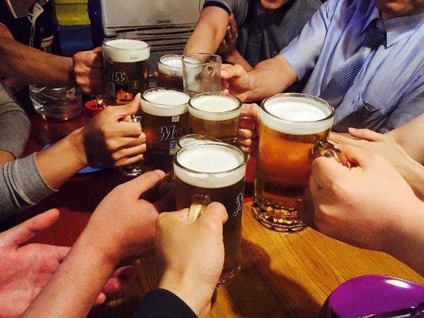

### 뉴로파이썬 기초
- 종료. (part 1 ~ 2)
- 스터디 주관 : 바이오스핀
- 2015년 3월 3일 - 6월 30일
- 매주 화요일 저녁. 7시 30분~9시 30분/10시
- 장소 : 토즈 타워점
- 이 스터디는 네이버D2의 지원으로 진행되었습니다.

### 링크
- [facebook ](https://www.facebook.com/notes/%EB%B0%94%EC%9D%B4%EC%98%A4%EC%8A%A4%ED%95%80/%ED%8C%8C%EC%9D%B4%EC%8D%AC%EC%9D%84-%EC%9D%B4%EC%9A%A9%ED%95%9C-bioinformatics-%EA%B8%B0%EC%B4%88/566279330148620)
- [github](https://github.com/biospin/neuropy/tree/gh-pages)
