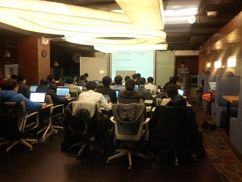

### 뉴로파이썬 기초 part 1
- 2015년 3월 3일 - 5월
- 매주 화요일 저녁. 7시 30분~9시 30분/10시
- 장소 : 토즈 타워점

### 최신글
- [03 Computational Neuroscience / 연습문제3 - 150315](doc/part1/study03/d03.md)
- [후기 ](doc/afterSchool.md)

### 링크
- [facebook ](https://www.facebook.com/notes/%EB%B0%94%EC%9D%B4%EC%98%A4%EC%8A%A4%ED%95%80/%ED%8C%8C%EC%9D%B4%EC%8D%AC%EC%9D%84-%EC%9D%B4%EC%9A%A9%ED%95%9C-bioinformatics-%EA%B8%B0%EC%B4%88/566279330148620)
